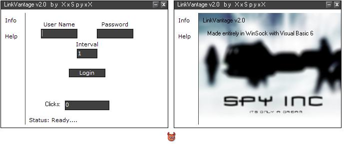



## LinkVantage v2 \[emu\]

### Description

Please check this code out, it shows many usefull things that every programmer should know such as system tray, emulating headers, parsing data, random stuff, and alot more! if you learn anything from this at least let it be form design I can't tell you how many apps die because they just look ugly... if you like this code please vote and comment. l8.
 
### More Info
 

             |
---                |---
**Submitted On**   |2001-12-25 02:09:26
**By**             |[XxSpyxX](https://github.com/Planet-Source-Code/PSCIndex/blob/master/ByAuthor/xxspyxx.md)
**Level**          |Advanced
**User Rating**    |3.5 (14 globes from 4 users)
**Compatibility**  |VB 4\.0 \(32\-bit\), VB 5\.0, VB 6\.0
**Category**       |[Internet/ HTML](https://github.com/Planet-Source-Code/PSCIndex/blob/master/ByCategory/internet-html__1-34.md)
**World**          |[Visual Basic](https://github.com/Planet-Source-Code/PSCIndex/blob/master/ByWorld/visual-basic.md)
**Archive File**   |[LinkVantag545202112002\.zip](https://github.com/Planet-Source-Code/xxspyxx-linkvantage-v2-emu__1-31689/archive/master.zip)

### Source Code

check out the zip for the code. Hopefully some of you learn something from this it has alot of great stuff that can be very usefull to know.

